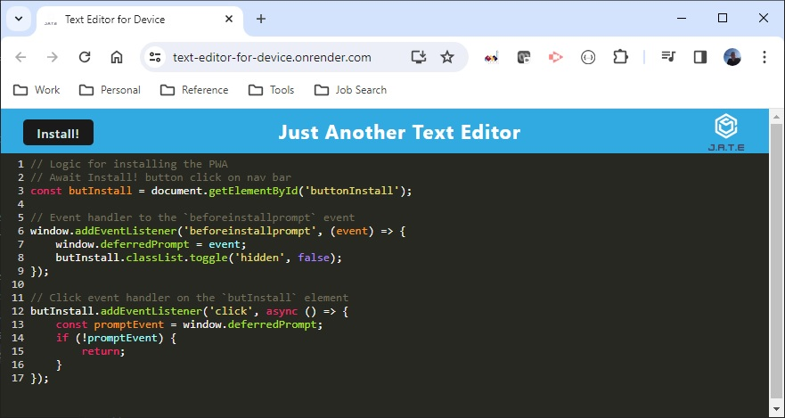

# Text Editor for Device

## Author
Tony Magrady - Berkeley Full-Stack Web Development Bootcamp student, Fall-Winter Session 2023-2024

## Badges

## Table of Contents

- [Description](#description)
- [Installation](#installation)
- [Usage](#usage)
- [Credits](#credits)
- [License](#license)

## Description

Text Editor for Device app is a text editor for application developers that runs in a browser and, as the name suggests, can be installed as a progressive web app (PWA) to run on the local client machine.   
(( Please Note:  
The app window title remains the same as the base code: "Just Another Text Editor".  
The icon and app abbreviation "JATE" are also the same as original. ))   
The app has been deployed to Render. Please refer to Installation section below for link and installation instructions.  
There is redundant data persistence using (a) IndexedDB / IDB wrapper as the primary database and (b) local storage as the backup. The application functions offline when running in the browser or as an installed app, and these access the same local IndexedDB storage.
 
## Installation

Text Editor for Device is deployed on Render and can be accessed at https://text-editor-for-device.onrender.com.   

Click Install! button to install PWA app locally, which also starts up the app for use.  

Packages used in development and execution of this app are:
- node.js (Javascript runtime)
- express (web app framework)
- concurrently (executes multiple bash shell commands concurrently)
- babel (compiles features down to a supported version)
- webpack (versatile Javascript bundling / packaging tool)
- idb (IndexedDB API wrapper)
- other supporting plugins for webpack.  

## Usage

Once in Text Editor for Device (also known as Just Another Text Editor), simply enter your application code as a basic text editor.  
There is no Save button. When you click off the browser (or out of your running app, if running as such), your changes are saved.  
When running in the browser, if the app is not installed, you can Install! as described in Installation section. But if the app is already installed, you can click "Choose an app" icon in the URL bar to run the editor on your local device. If installed, you can also run the app directly by clicking the JATE app icon on the tray. 
Upon initial application access or when refreshing after clearing out all data, a banner will appear in the text area, "JATE - just another text editor". It will disappear when you start typing, and the banner text will not be saved to the database.  
Text Editor for Device app maintains one "file" or data store of application code (or content of your choosing). A future version will enable creation and maintenance of multiple code "files" / data stores.  

## Credits

Thank You for Berkeley Boot Camp live sessions on the topic of Progressive Web Apps -- and Zoom videos of the same, in addition to the copious links to reference documents and examples shared by the instructors.

## License

The MIT License

Copyright (c) (2023) (Tony Magrady)

    Permission is hereby granted, free of charge, to any person obtaining a copy
    of this software and associated documentation files (the "Software"), to deal
    in the Software without restriction, including without limitation the rights
    to use, copy, modify, merge, publish, distribute, sublicense, and/or sell
    copies of the Software, and to permit persons to whom the Software is
    furnished to do so, subject to the following conditions:
    
    The above copyright notice and this permission notice shall be included in all
    copies or substantial portions of the Software.
    
    THE SOFTWARE IS PROVIDED "AS IS", WITHOUT WARRANTY OF ANY KIND, EXPRESS OR
    IMPLIED, INCLUDING BUT NOT LIMITED TO THE WARRANTIES OF MERCHANTABILITY,
    FITNESS FOR A PARTICULAR PURPOSE AND NONINFRINGEMENT. IN NO EVENT SHALL THE
    AUTHORS OR COPYRIGHT HOLDERS BE LIABLE FOR ANY CLAIM, DAMAGES OR OTHER
    LIABILITY, WHETHER IN AN ACTION OF CONTRACT, TORT OR OTHERWISE, ARISING FROM,
    OUT OF OR IN CONNECTION WITH THE SOFTWARE OR THE USE OR OTHER DEALINGS IN THE
    SOFTWARE.